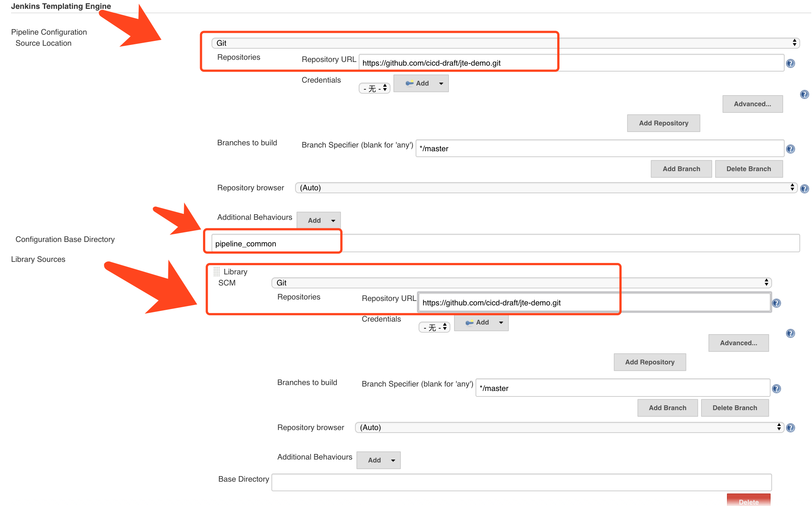

# JTE-demo
Jenkins Templating Engine demo. This repo also includes **share libraries**

### 1. Start a jenkins instance
e.g.

`docker run --name jenkins -d -p 8081:8080 -v /var/run/docker.sock:/var/run/docker.sock cicddraft/jenkins:v0.4`

>more details about the instance ,please go to docker image [introduction](https://cloud.docker.com/u/cicddraft/repository/docker/cicddraft/jenkins).

### 2. Install plugin 
"Manage Jenkins" >> "Manage Plugins" 

plugin : [Templating Engine](https://wiki.jenkins.io/display/JENKINS/Templating+Engine+Plugin)

### 3.Configure the plugin

---
Ref:

- [Introduction](https://jenkins.io/blog/2019/05/09/templating-engine/)
- [Leverage Lifecycle Hooks](https://boozallen.github.io/jenkins-templating-engine/master/pages/Library_Development/lifecycle_hooks.html)
- https://boozallen.github.io/jenkins-templating-engine/master/index.html?nsukey=hSi4kla9VTQXZ664d7ecXuasE9GAlHnQElKXvjxMsOk367Sjd3YqgQ%2BaO%2Flq6O9HtAYcywHulsIfmW%2F%2BwRN2A7S9Y4yrbNQdYj0CgNn6HYVdEKfw1bYZDmFTiLJCl4FIY%2BL7nd9VyhR97TZyHpmgiIVxH33ai6K6GnLhSEt0qlOHUji%2Fafw0amjZC4SkatIhOb7Ym5qhp2ImTCl8IP3KoA%3D%3D